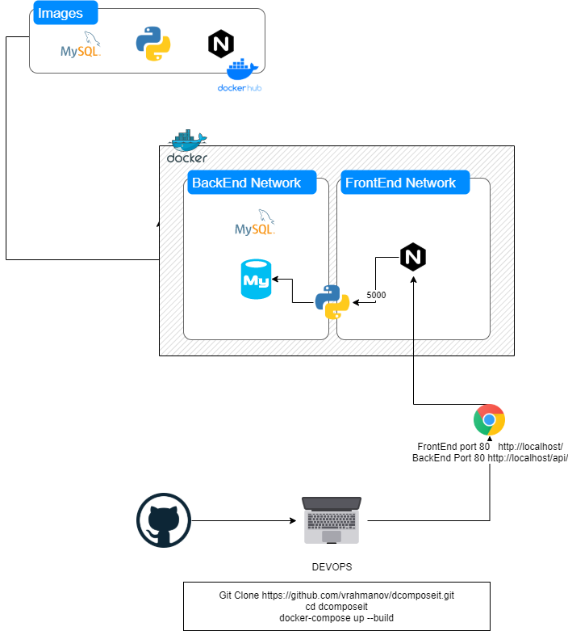

###Docker env Architecture

# Full stack Docker Env
Demo running full env with dockers including :

```
Frameworks:
Python 
Flask
Mysql
Nginx

Wrappers:
Docker
Docker-compose

FrontEnd: Nginx, html
Backend: Flask, Python
DB: mysql
```

#Instructions

```
1) Git Clone https://github.com/vrahmanov/dcomposeit.git
2) cd dcomposeit
3) docker-compose up --build
4) browse : http://localhost
```